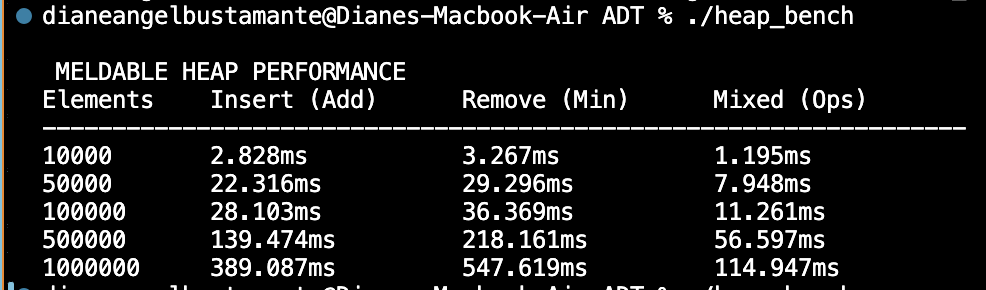

<div align="center">


[](#)
[](#)
[](#)

<br>
<i>A handcrafted, rigorously benchmarked C++17 library. Built for speed. Designed for CMSC 123.</i>
<br><br>

</div>

---

### Goals
- Enforce clean **interface-driven design**
- Demonstrate **correct time complexities in practice**
- Provide **interactive and testable implementations** of core data structures
- Serve as a **learning and benchmarking tool** for CMSC 123

---
## 🚀 The Data Structures

We rejected the standard textbook code. Every structure here is strictly bound by **abstract interfaces** and benchmarked at scale to prove its mathematical time complexity.

|  Abstract Type |  Our Implementation |  Highlights & Twists |  Dev |
| :--- | :--- | :--- | :--- |
| **FIFO Queue** | `SLList` | Tail-pointer optimized for instant $O(1)$ enqueues. | Dexter |
| **FILO Stack** | `ArrayStack` | Dynamic memory scaling and ghost scrubbing. | Dexter |
| **Unsorted Set** | `Chained HashTable` | Custom hash routing with linked-node collisions. | Dexter |
| **Sorted Set**| `SkipList` | Randomized height layers for rapid $O(\log n)$ jumps. | Janelle |
| **Bi-Directional List** | `DLList` | Complete spatial node traversal and pooling. | Janelle |
| **Graph** | `Adjacency Matrix` | Instant edge lookups and matrix-based routing. | Janelle |
| **Sorted Set**| `Red-Black Tree` | Self-balancing rotations and strict color rules. | Diane |
| **Double-Ended Queue** | `ArrayDeque` | Circular array arithmetic and wrap-around logic. | Diane |
| **Priority Queue**| `Heap` | Optimized tree-based extraction of min/max values. | Diane |

---

## 🗂️ The Interface-Driven Architecture

Instead of dumping all our code into single files, we built a highly modular pipeline. 

<table>
  <tr>
    <td width="50%" valign="top">
      <h3> The Contracts (<code>include/</code>)</h3>
      Pure virtual C++ base classes. These files act as the law, forcing our implementations to obey strict behavioral rules (e.g. <code>queue.h</code>, <code>deque.h</code>).
    </td>
    <td width="50%" valign="top">
      <h3> The Engines (<code>src/</code>)</h3>
      The raw C++ code where the algorithms actually live and manage memory (e.g. <code>sllist.h</code>, <code>chainedhashtable.h</code>).
    </td>
  </tr>
  <tr>
    <td width="50%" valign="top">
      <h3> The Crucible (<code>tests/</code>)</h3>
      Rigorous edge-case execution scripts. These prove that popping an empty queue throws the correct error rather than crashing the program.
    </td>
    <td width="50%" valign="top">
      <h3> The Stopwatch (<code>time_benchmark/</code>)</h3>
      <code>&lt;chrono&gt;</code> powered microsecond scripts. We use these to mathematically prove that our $O(1)$ methods actually run in $O(1)$ time.
    </td>
  </tr>
</table>

---

## 🛠️ Installation & Setup

Before running the benchmarks or tests, ensure your environment is ready. 
This library requires a compiler that supports the **C++17** standard (GCC 7+ or Clang 5+).

```bash
# Clone the repository
git clone https://github.com/jnl-r/ADT.git
cd ADT

# Verify your compiler version
g++ --version
```
---
## Interactive Tests !

Our interactive test scripts are built for you to experiment. You can manually add, remove, and find elements to see how the logic handles your specific inputs. Have fun with it!

```bash
# 1. Choose a Structure and Compile
# Example: Testing the Red-Black Tree
g++ -std=c++17 tests/rbtree.cpp -I include -o rbtree_test

# 2. Run and Follow the Menu
# When you execute the file, a Command Header will appear automatically, listing every available operation (e.g., add, remove, find, size).
./rbtree_test
```

<p align="center">
  
</p>
<p align="center">
  <i>Interactive test run of the Red-Black Tree</i>
</p>

---
### 📁 Performance Benchmarking
---
Our benchmarking suite uses fixed input sizes ranging from **10,000 to 1,000,000 elements** to provide a standardized performance report. This allows you to observe how each data structure scales under increasing workloads.

```bash
# 1. Compile the Meldable Heap benchmark
g++ -std=c++17 time_benchmark/meldableheap_benchmark.cpp -I include -o heap_bench

# 2. Run the automated suite (no input required)
./heap_bench
```
<p align="center">
  
</p>

<p align="center">
  <i>Note: Actual performance may vary depending on hardware and compiler optimizations.</i>
</p>

### References
---
- Morin, P. *Open Data Structures (C++ Edition)*. [opendatastructures.org](https://opendatastructures.org/) 
  - Randomized Meldable Heap
  - Red-Black Trees

### <3 Contributing
---

This project was developed as a **Final Requirement for CMSC 123 (Data Structures and Algorithms)** during the 1st Semester.

It is a collaborative effort focused on applying theoretical concepts of **Abstract Data Types (ADTs)** into fully functional and benchmarked C++ implementations.
### Guidelines
- Follow existing coding style
- Use clear function naming
- Maintain separation of interface and implementation

### 📞 Contact
---
- Dexter Rico - jcrico2@up.edu.ph
- Janelle Ranario - jrranario1@up.edu.ph
- Diane Bustamante - dcbustamante@up.edu.ph 

## 🚧 Future Improvements

- Add unit testing framework (e.g., Google Test)
- Expand benchmark visualizations
- Implement additional structures (e.g., AVL Tree)
- Optimize memory pooling strategies
 
---
## 📜 License

This project is licensed under the **GNU General Public License v3.0 (GPL-3.0)**.

You are free to use, modify, and distribute this software under the terms of the license. Any derivative work must also be distributed under the same license.

See the full license here:  
[LICENSE](./LICENSE)